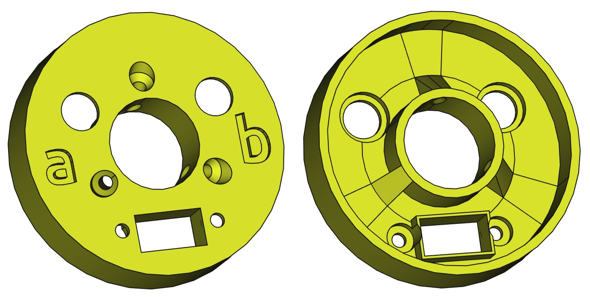
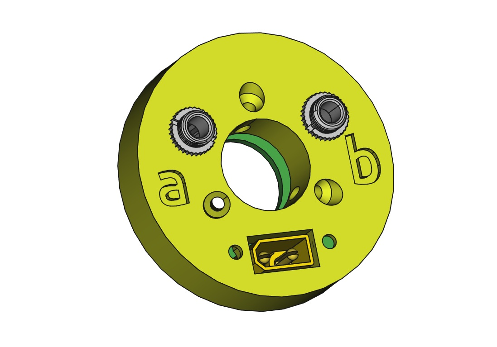

# LightPipe End Cap

This repo contains an end cap for terminating a LightPipe on both sides. It has holes for all connectors and can be attached to the center wooden rod with screws.

A legend on the holes indicates

- a … for another pipe and
- b … for backchannel.

